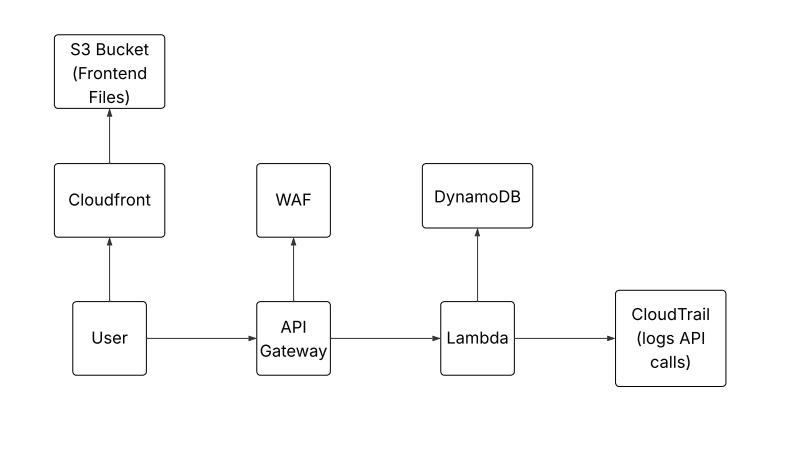
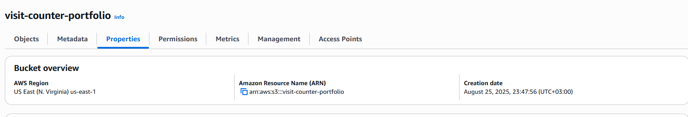
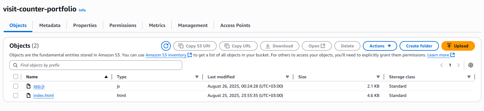

# Cloud Project 2 – Serverless Counter App with Security & Logging

This project demonstrates how to build a serverless, secure, and monitored web application using AWS services.  
It consists of a static frontend hosted on **CloudFront** that interacts with an API Gateway + Lambda backend.  
The application counts page visits and includes **security (AWS WAF)** and **monitoring (CloudTrail)**.

Live Demo: [CloudFront Deployed App](https://d1nnswwl0n5ldc.cloudfront.net)
  
---

##  Project Overview
- **Frontend:** Static HTML/JS webpage hosted on **S3 + CloudFront**  
- **Backend:** **API Gateway** that triggers an **AWS Lambda** function  
- **Database:** **DynamoDB** used to store and increment page visit counts  
- **Security:** **AWS WAF Web ACL** with rate limiting to protect API Gateway from abuse  
- **Monitoring:** **CloudTrail** enabled to log and track API Gateway calls  
- **Deployment:** CloudFront used for global CDN distribution of the frontend  

---

##  Architecture
Here’s the logical architecture you should recreate in a diagram tool (e.g., draw.io, Lucidchart, Excalidraw):

1. **User Browser** → accesses static frontend via **CloudFront Distribution**  
2. **CloudFront** → serves files from **S3 Bucket (Static Website Hosting)**  
3. **Frontend** → makes `fetch` requests to **API Gateway Endpoint**  
4. **API Gateway** → forwards request to **Lambda Function**  
5. **Lambda Function** → updates/increments **DynamoDB Table** and returns the count  
6. **WAF Web ACL** → attached to API Gateway to enforce rate limiting and block suspicious traffic  
7. **CloudTrail** → logs all API calls for auditing and monitoring  

---

## 🔐 Security & Logging
- **AWS WAF**: Configured with a Web ACL and rate-based rule to protect against brute force or DDoS-style attacks.  
- **CloudTrail**: Set up to capture API Gateway activity, including which IPs are making requests. This helps with auditing and debugging.  

---

## 🚀 Steps Performed
1. Created **S3 bucket** for hosting frontend files.  
   
   

3. Configured **CloudFront** distribution to serve files globally.  
   

4. Developed **Lambda function** to update DynamoDB counter.  
   

5. Set up **DynamoDB table** with partition key for storing visit counts.  
   

6. Exposed Lambda via **API Gateway** with `POST`/`GET` method integration.  
   

7. Updated frontend JavaScript to call the API Gateway endpoint.  
   

8. Added **AWS WAF** Web ACL with rate limiting rule.  
   

9. Enabled **CloudTrail** to monitor API calls.  
   

---

## 🌐 Live Demo
Access the deployed app here:  
👉 [https://d1nnswwl0n5ldc.cloudfront.net](https://d1nnswwl0n5ldc.cloudfront.net)

---
